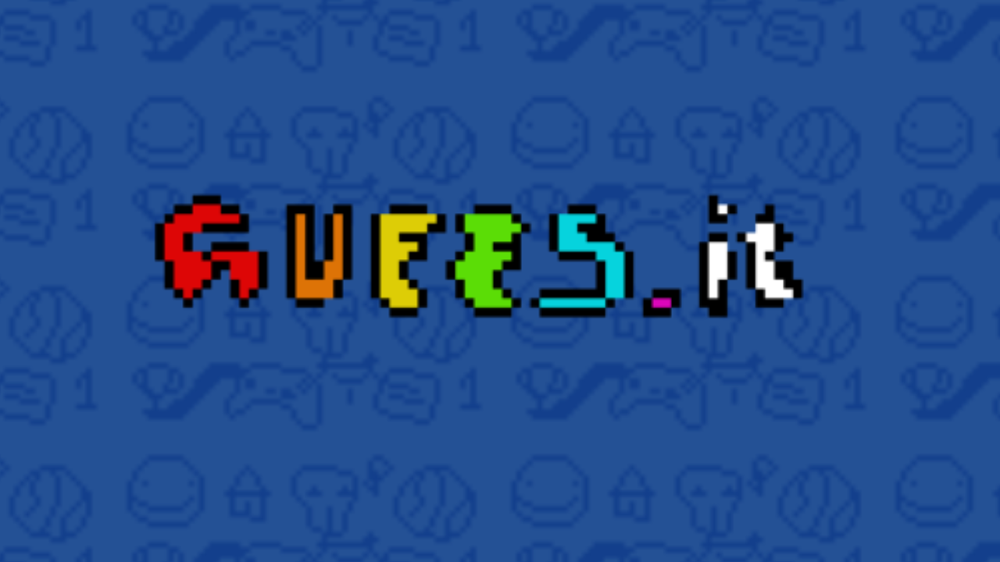
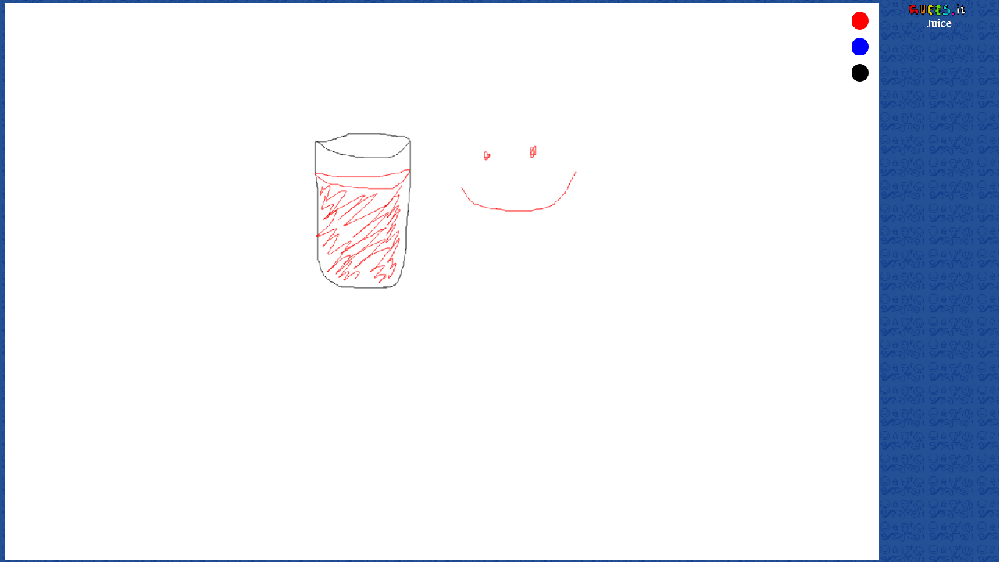

# 🎨 GuessIT
<h3 align="center"></h3>
GuessIT is a real-time, multiplayer web game inspired by classic Pictionary and online games like Skribbl.io. Players take turns drawing a word while others try to guess it as fast as they can to earn points. Play with friends or random players and enjoy fun, creative chaos together!

---
# Check it out here: [GateBase Live](https://guessit-frontend.onrender.com)
## 🌟 Features

- ✏️ **Drawing canvas**: Draw words using a simple, smooth in-browser canvas.
- 💬 **Real-time guessing**: Other players guess the word live as you draw.
- 👫 **Multiplayer rooms**: Create or join game rooms to play with friends.
- 🎨 **3 Colors**: Choose between 3 colors to draw what you want.

---
## ⏰ WAP features 
- 🔥 **Scoring system**: Points awarded for correct and fast guesses.
- ⏰ **Round timer**: Keep the game fast-paced and competitive.
- 🎉 **Word suggestions**: Choose from a set of words before drawing.
- 🖌️ **More colors**: Ability to choose more colors.
- 🎉 **Undo/Erase**: Ability to erase your mistakes.

## 🚀 Tech Stack

- **Frontend**: HTML, CSS, JavaScript
- **Backend**: Node.js
- **Real-time**: Socket.IO for live drawing and chat updates
---
## 📸 Screenshots 

### ✏️ Drawer POV
<h3 align="center"></h3>

### 🤔 Guesser POV
<h3 align="center"></h3>

Made with ❤️ by [Subhajit Basak](https://www.linkedin.com/in/subhajit-basak-algobuddha/)